# Project Automation using JENKINS

## What it does?:

1. Check git repository for nedw commit
2. clone the code into the system
3. Compile test/Using JRE create class file
4. Check if class file is created successfully
5. Run the code in java environment
6. Check the output
7. If the output is successful
8. Declare success

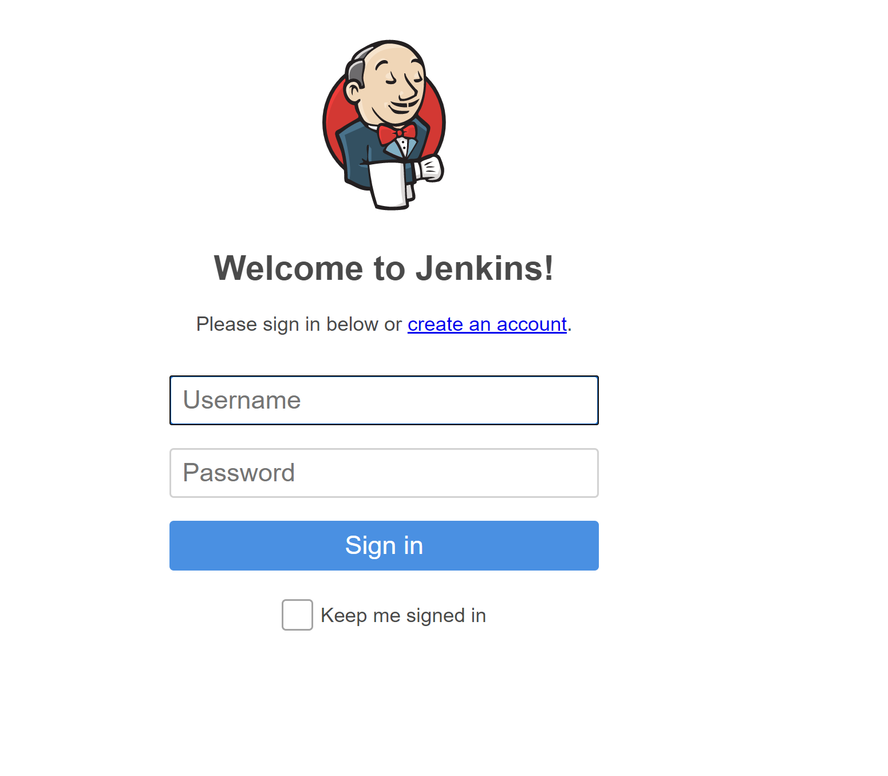

## Main View of Jenkins Desktop View

## Assignment Project View
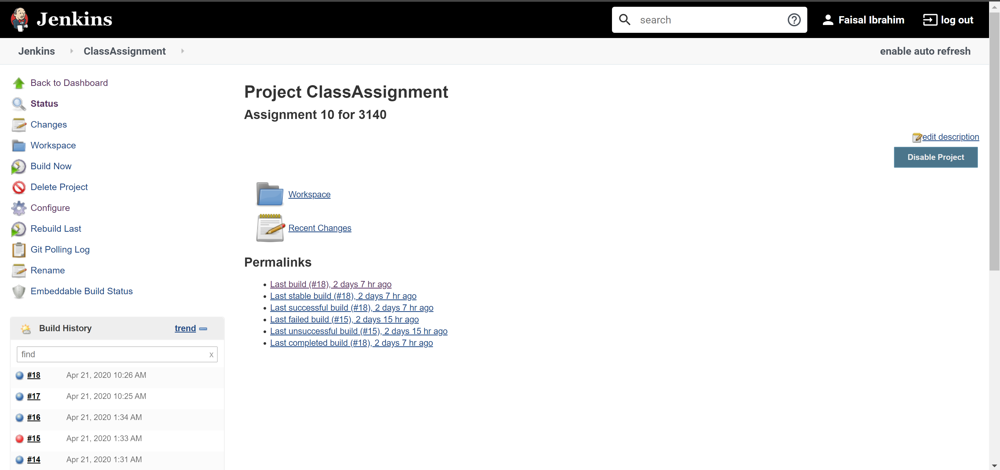

## Build History
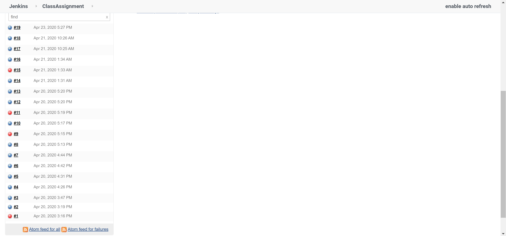

## Git Polling Log
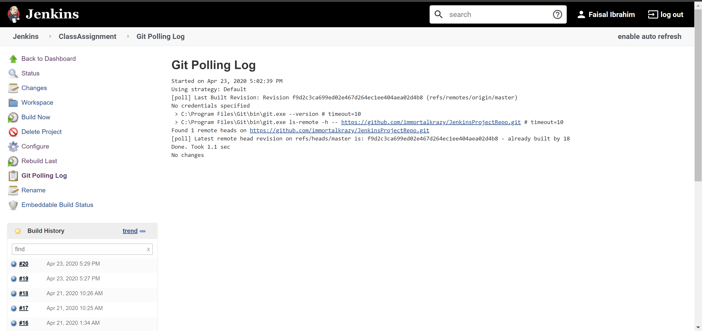

## Git Build Data
- Git commit hash code
- Branch name local and github
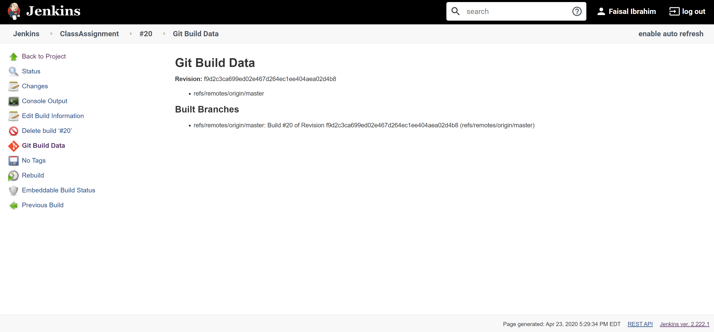

## Console output of the cloned repository
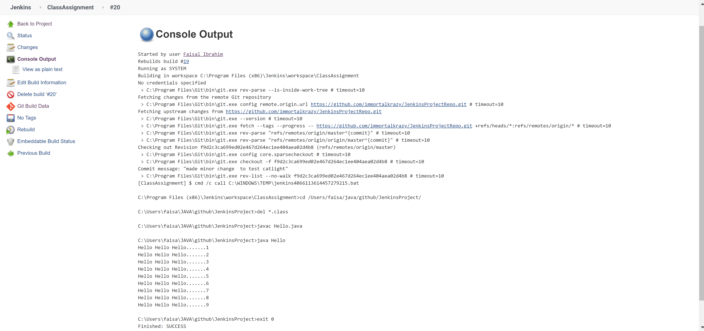

## Jenkins project/Assignment project Configuration page
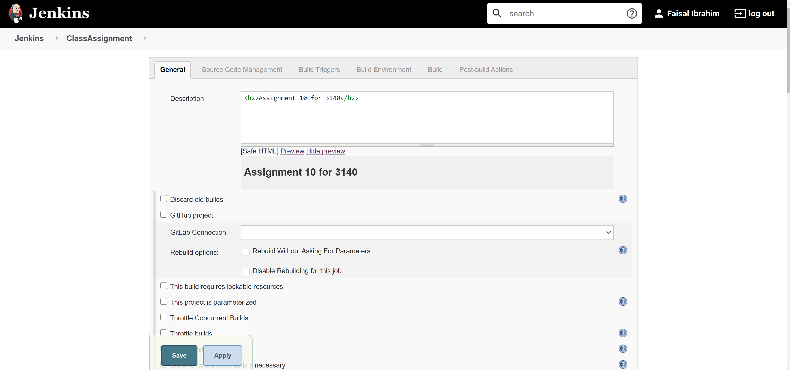

## Source code management page
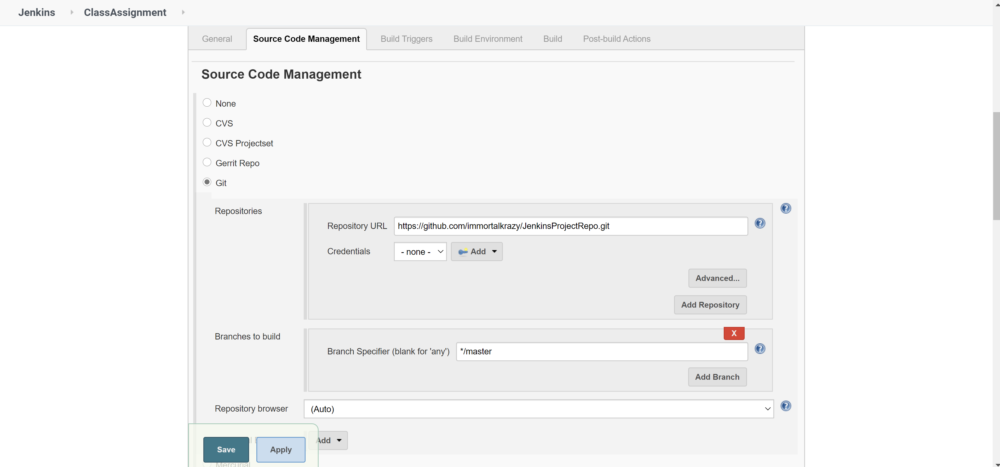

## Build Triggers
- How frequent the project would be run
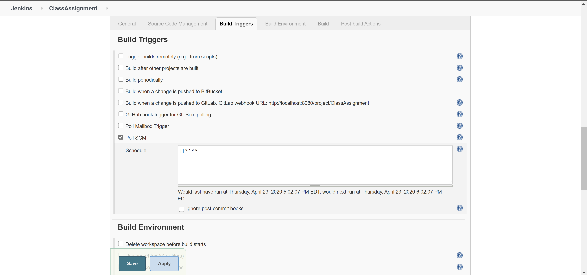

## Build Settings
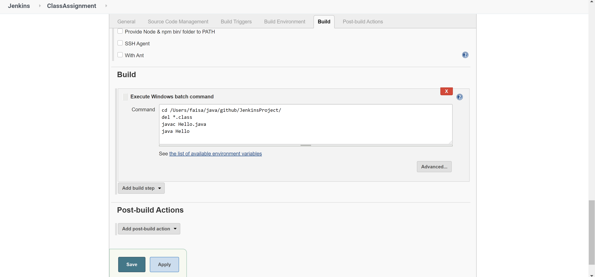

## Use of CatLight
- Desktop notifications for builds happening in jankins
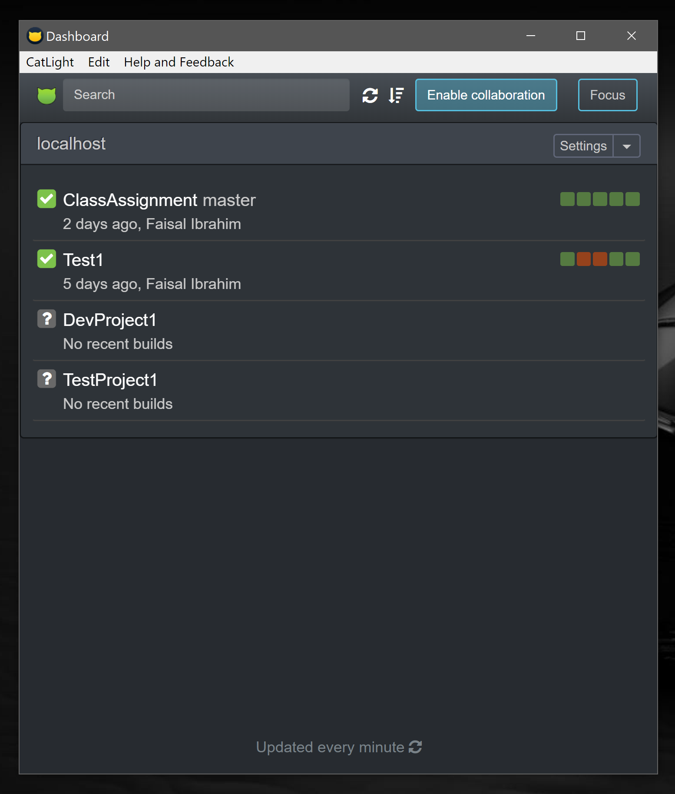
